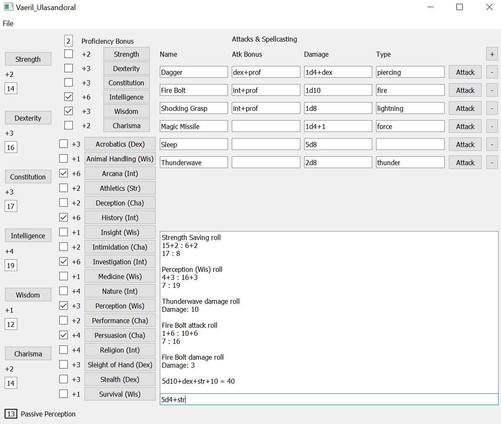

# dnd-roller
## Introduction
Add in attribute scores and check off which skills are proficient and the program will automatically calculate all modifiers. Rolling for strength checks, saving throws, or any skill is as simple as pushing the correct button.

Additionally, data can be added to the "Attacks & Spellcasting" section for attack and damage rolls. These are written similarly to the way they are on a standard character sheet (name, attack bonus, damage, and type). The attack bonus and damage can be written as any combination of dice rolls, numbers, and modifier shorthands.

Below the output log there is a space for manually inputting any dice rolls and modifiers (in the same format as the attack bonus and damage rolls) which are not already covered.

Finally, when you are done with any setup of your character you can save and name the data to be loaded in another time.

## Modifier Shorthand

prof = Proficiency

str = Strength

dex = Dexterity

con = Constitution

int = Intelligence

wis = Wisdom

cha = Charisma

## How to Use
To run this code you will need python3 with pyqt5. Python3 can be downloaded from python.org. After installing python3, you can install pyqt5 by running the below command in a terminal window.

```
pip install PyQt5
```

In order to start the program run the file dnd_roller_gui.py. This can be done from a terminal with

```
python3 dnd_roller_gui.py
```

## Example



## Contributing
Anyone who wants is free to work on any of the issues listed in the issue tracker or create there own. Please contact me through the issue tracker before begining if you would like your changes to be included in this repository.

Changes should be done through a pull request coming from your clone of the repository.

# Inspiration
The inspiration for this comes directly from the character sheet interface from the roll20 website.
